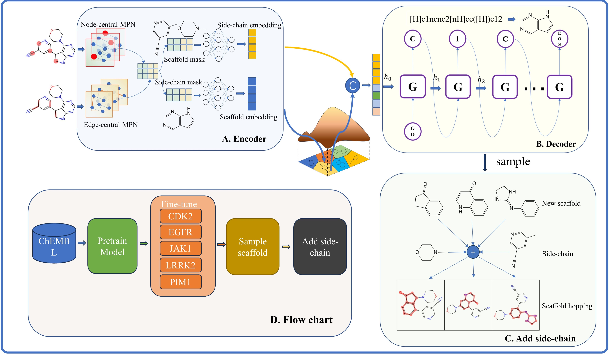

# ScaffoldGVAE
ScaffoldGVAE: A Variational Autoencoder Based on Multi-View Graph Neural Networks for Scaffold Generation and Scaffold Hopping of Drug Molecules. [(article)](https://jcheminf.biomedcentral.com/articles/10.1186/s13321-023-00766-0)



# Installation
You can use the environment.yml file to create a new conda environment with all the necessary dependencies for ScaffoldGVAE.
```
git clone git@github.com:songleee/ScaffoldGVAE.git
cd ScaffoldGVAE
conda env create -f environment.yml
conda activate ScaffoldGVAE
```
Additional data files could be downloaded from [Google Drive](https://drive.google.com/drive/folders/1tV307SNEkBokOTQLrDh0IqLXbFc5Oliq?usp=sharing)

# Usage
ScaffoldGVAE includes three sub-modules:
1. `Sca_extraction.py`: The molecular scaffolds was extracted and the data set was constructed.

2. `Train.py`: Used for pre-training on big dataset.

3. `fine_tuning.py`: Used for fine-tuning the pre-trained neural network on the known bioactive compounds against specific protein targets.

4. `sample.py`: Given a reference molecule and its corresponding scaffold ,sampling new scaffolds and adding side-chain for scaffold hopping.

Example of running the command:
```
python Sca_extraction.py

python pre_train.py

python fine_tuning.py

python sample.py
```

# License
This project is licensed under the terms of the [CC-BY-NC-ND-4.0](https://creativecommons.org/licenses/by-nc-nd/4.0/legalcode) license.

# Citation
If you find this work useful, please cite us:

Hu, C., Li, S., Yang, C. et al. ScaffoldGVAE: scaffold generation and hopping of drug molecules via a variational autoencoder based on multi-view graph neural networks. J Cheminform 15, 91 (2023). https://doi.org/10.1186/s13321-023-00766-0

